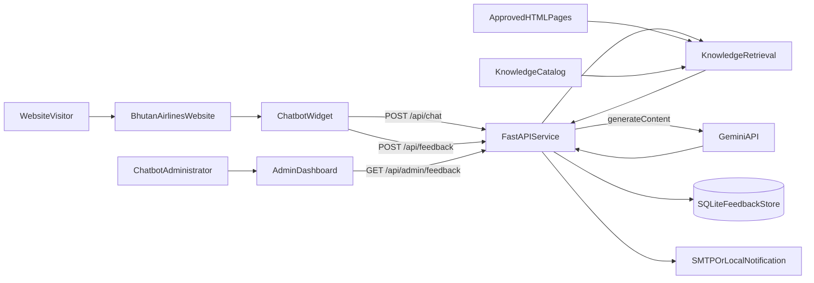
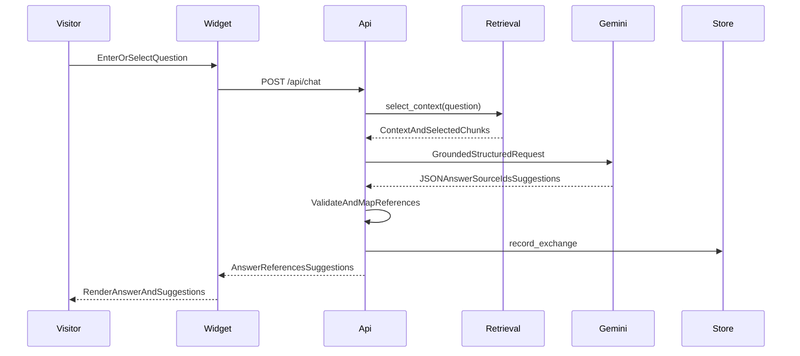

# Chatbot Architecture

| Field | Value |
| --- | --- |
| System | OMG Experience AI Chatbot |
| Status | Draft |
| Architecture type | Static web widget with a FastAPI backend |
| Last updated | 2026-09-18 |

## 1. Overview

The chatbot consists of a framework-free browser widget, a Python FastAPI
service, a retrieval layer built from approved website HTML, a Gemini model
integration, SQLite conversation storage, and a static administrative
dashboard.

The browser never calls Gemini directly. It sends JSON requests to the FastAPI
service, which keeps credentials server-side, selects relevant website content,
calls the model, validates the structured result, and returns a constrained
response to the widget.

## 2. System context

## 3. Repository components

| Component | Location | Responsibility |
| --- | --- | --- |
| Browser widget | `widget/chatbot.js` | Renders the interface and manages state, guided flows, anonymous IDs, API calls, follow-ups, and feedback. |
| Widget styles | `widget/chatbot.css` | Provides responsive visual presentation and state-specific styling. |
| API application | `server/app.py` | Loads configuration, defines schemas and endpoints, applies CORS, calls Gemini, validates responses, and coordinates storage. |
| Prompt policy | `server/prompts.py` | Defines grounding, safety, commercial, citation, and output rules. |
| Knowledge retrieval | `server/knowledge.py` | Parses catalogued HTML into sections and ranks relevant chunks for a question. |
| Knowledge catalog | `knowledge/catalog.json` | Lists approved pages, titles, relative URLs, categories, and retrieval aliases. |
| Feedback store | `server/feedback_store.py` | Defines the storage interface and implements conversation/feedback persistence in SQLite. |
| Feedback notification | `server/feedback.py` | Validates feedback options, logs feedback, and attempts SMTP or local macOS Mail notification. |
| Admin dashboard | `admin/dashboard.html`, `admin/dashboard.css`, `admin/dashboard.js` | Presents aggregate metrics, filters, pagination, comments, and conversation histories. |
| Website knowledge | `../Resources/*.html` | Supplies source content for grounded answers. |

## 4. Runtime topology

The static website, widget assets, and API can be served from separate hosts.
The widget discovers its API through the script element's `data-api` attribute
and derives the feedback endpoint from it unless a separate
`data-feedback-api` value is supplied.

The API process loads configuration from `chatbot/.env` during startup. In
production, equivalent values should come from the platform's secret and
environment configuration rather than a deployed file.

### Required external connectivity

- The visitor's browser must reach the static website, widget assets, and API.
- The API must reach the configured Gemini API URL.
- If SMTP notification is enabled, the API must reach the SMTP host.

## 5. Chat request flow

1. The widget creates an anonymous `user_id` in `sessionStorage` when possible
   and a `conversation_id` for the current conversation.
2. It sends the current message and up to 20 recent user/assistant messages.
3. Pydantic validates identifier formats, message lengths, roles, and history
   limits.
4. The retrieval layer ranks knowledge chunks using query-term matches in
   metadata and text. It selects up to 10 chunks within a 30,000-character
   context budget.
5. The API combines the selected context with the visitor question and the
   server-side system prompt.
6. Gemini is requested to return JSON containing `answer`, `source_ids`, and
   `suggestions`. The current configuration uses low temperature, disables the
   model's thinking budget, and reserves up to 1,024 output tokens.
7. The API accepts only source IDs from the selected chunks, deduplicates URLs,
   limits references to four, and limits suggestions to three.
8. The exchange is appended to SQLite. A storage failure is deliberately
   non-blocking for the chat response.
9. The widget renders the answer and follow-up actions. Although references are
   present in the API response, the current `sendMessage` implementation does
   not pass `data.references` into the rendering path.

### Fallback behavior

The API returns a stable contact response with `fallback: true` when:

- the Gemini API key is not configured;
- no knowledge was loaded;
- the model returns no usable answer; or
- the upstream request or response parsing fails.

This keeps the visitor interface usable but does not distinguish upstream
failure types in the public response.

## 6. Knowledge ingestion and retrieval

At API import/startup:

1. `knowledge/catalog.json` is validated.
2. Each listed file is resolved under `KNOWLEDGE_DIR`.
3. Beautiful Soup removes scripts, styles, navigation, footer, forms, SVG, and
   other non-content elements.
4. Content is split around `h1` through `h4` headings.
5. Each chunk receives a stable source ID, title, section, category, aliases,
   text, and website URL.

For every question, a lightweight lexical score ranks chunks. Metadata term
matches receive more weight than body-text occurrences, while overview content
receives a small bonus. This is deterministic retrieval, not vector search or
semantic embeddings.

The current catalog covers overview, destinations, fares, travel information,
contact, Book & Hold, and travel guides.

## 7. API surface

| Method and path | Access | Purpose |
| --- | --- | --- |
| `GET /health` | Public | Reports model configuration, loaded knowledge, model name, notification recipient, and feedback-store diagnostics. |
| `POST /api/chat` | Public, CORS-restricted in browsers | Produces a grounded response and records the exchange. |
| `POST /api/feedback` | Public, CORS-restricted in browsers | Stores categorised feedback and attempts notification. |
| `GET /admin/feedback` | Static page | Serves the feedback dashboard HTML. |
| `GET /api/admin/feedback` | Bearer token remotely | Returns filtered, paginated records and aggregate summary data. |
| `GET /docs` | Public by current application configuration | Serves FastAPI's generated OpenAPI interface. |

Request and response details are also available from FastAPI's generated
`/docs` interface while the service is running.

## 8. Persistence model

The MVP stores one row per `conversation_id` in
`Chatbot_Feedback_Table`:

| Field | Meaning |
| --- | --- |
| `id` | Internal UUID for the record |
| `conversation_id` | Unique browser conversation identifier |
| `user_id` | Anonymous session identifier |
| `chatbot_interaction` | JSON array of user and assistant messages |
| `feedback` | JSON object containing the selected option and comment, or an empty object |
| `created_at` | UTC creation timestamp |
| `updated_at` | UTC timestamp of the most recent exchange or feedback update |

`FeedbackStore` is a protocol boundary. `SQLiteFeedbackStore` is the current
adapter, and the code comments identify a DynamoDB-backed implementation as a
possible deployment replacement.

## 9. Feedback flow

1. The widget sends the anonymous IDs, bounded interaction history, selected
   feedback option, and optional comment.
2. The API rejects options outside the server's allowed list.
3. The store updates the existing conversation or creates a record when needed.
4. The notifier always appends a local feedback log, then attempts SMTP. On
   macOS without SMTP it may attempt the Mail app.
5. Notification failure does not remove stored feedback; the response identifies
   whether email was sent and which method was used.

## 10. Administrative access

The admin dashboard calls `/api/admin/feedback` with optional search, feedback
category, limit, and offset values.

- When `ADMIN_DASHBOARD_TOKEN` is configured, the API requires a matching
  bearer token using constant-time comparison.
- When no token is configured, only loopback/test clients are permitted.
- Remote requests without a configured token receive a service-unavailable
  response rather than open access.
- The dashboard keeps a supplied token in browser `sessionStorage`, not
  persistent local storage.

The static dashboard files themselves are not confidential; access control is
enforced on the data endpoint.

## 11. Configuration

| Variable | Purpose |
| --- | --- |
| `GEMINI_API_KEY` | Server-only model credential |
| `GEMINI_MODEL` | Model used for content generation |
| `GEMINI_API_URL` | Base model API URL |
| `KNOWLEDGE_DIR` | Directory containing approved website HTML |
| `ALLOWED_ORIGINS` | Exact browser origins permitted by CORS |
| `FEEDBACK_DATABASE_PATH` | SQLite database location |
| `FEEDBACK_TO` | Feedback notification recipient |
| `ADMIN_DASHBOARD_TOKEN` | Bearer token required for remote admin data |
| `SMTP_HOST`, `SMTP_PORT`, `SMTP_USER`, `SMTP_PASSWORD`, `SMTP_FROM` | Optional SMTP delivery configuration |

The `.env.example` file documents expected names without containing operational
secret values.

## 12. Security and privacy boundaries

### Implemented controls

- Gemini and SMTP credentials remain server-side.
- Browser origins are allow-listed for cross-origin requests.
- Request lengths, history sizes, roles, identifier formats, filters, limits,
  and offsets are validated.
- Model citations are restricted to source chunks supplied for the request.
- Remote administrative data uses bearer-token protection.
- Prompt policy prohibits collecting sensitive credentials and claiming a
  completed booking.

### Boundaries requiring deployment controls

- CORS is a browser control, not API authentication for public chat endpoints.
- The public chat and feedback endpoints do not currently implement rate
  limiting, quotas, bot detection, or visitor authentication.
- SQLite is local process storage and needs a production backup, retention, and
  concurrency decision.
- TLS, firewalling, process isolation, secret rotation, monitoring, and log
  redaction are responsibilities of the hosting environment.
- Conversation text can contain information typed by visitors even though the
  generated IDs are anonymous; retention and deletion policy remains an
  operational decision.

## 13. Failure modes and observability

| Failure | Current behavior |
| --- | --- |
| Missing model key or knowledge | `/health` reports configuration required; chat returns contact fallback. |
| Invalid catalog or missing page | Startup records a knowledge error and loads no usable knowledge. |
| Gemini timeout, HTTP error, or malformed result | Chat returns contact fallback. |
| SQLite initialization error | Health diagnostics report the error; chat remains available without guaranteed recording. |
| Feedback storage error | Feedback endpoint returns an explicit unsuccessful response. |
| Feedback email error | Stored feedback remains available; response reports database/log-only handling. |
| Invalid or missing remote admin token | Admin data endpoint rejects access. |

The MVP has health diagnostics but no integrated metrics, tracing, centralised
logging, or alerting.

## 14. Architectural decisions and trade-offs

- **Static, dependency-free widget:** easy to embed, but the JavaScript and CSS
  files are large and require manual modularisation as complexity grows.
- **HTML as knowledge source:** aligns answers with published content, but
  requires an API restart to reload changed pages.
- **Lexical retrieval:** simple and explainable, but weaker for synonyms and
  intent that are not represented in catalog aliases or page text.
- **Structured model output:** simplifies safe rendering and reference mapping,
  but upstream schema/model compatibility must be monitored.
- **SQLite storage:** low operational cost for the MVP, but not yet a
  horizontally scalable persistence design.
- **Fail-open conversation recording:** storage issues do not block visitor
  answers, but analytics can be incomplete without an alerting layer.

## 15. Open architecture decisions

- Production persistence technology and migration path
- Database backup, retention, deletion, and access policy
- Public endpoint rate limiting and abuse protection
- Monitoring, alerting, and service-level objectives
- Knowledge refresh and content approval workflow
- Widget rendering for the validated references already returned by `/api/chat`
- Whether `/docs`, detailed health fields, and feedback recipient details should
  remain publicly exposed in production
- Strategy for automated unit, integration, accessibility, and end-to-end tests
